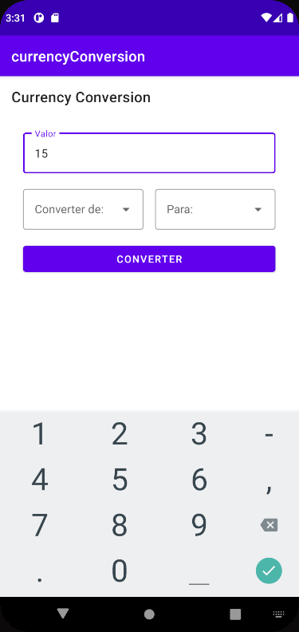

# Currency Conversion
### Sobre o Projeto
Ultimo desafio do bootcamp Androind Carrefur da DIO, o objetivo deste projeto foi criar 
um App de conversão de moedas/câmbio, passando por todo o processo de desenvolvimento usando o Kotlin.
### Interface
O app contém uma interface simples intuitiva, com um campo que permite o usuario digitar o valor que ele queira converte, dois inputs que permite a seleção da moeda de onde ele quer converter para qual ele deseja converter e um botão de conversão.
### Detalhes da Aplicação
Para o funcionamento do app foi utilizado a API ``AwesomeAPI: API`s`` onde fornece o mais de 150 moedas diferentes.
O Usuario digita um volar e pode selecionar uma moeda em seguida escolhe pra qual ele quer converter onde o resultado é exibido na tela.
### GIF demonstrativo
